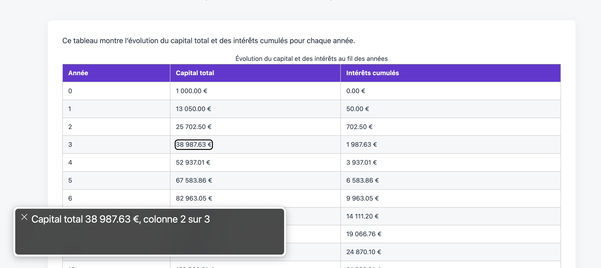
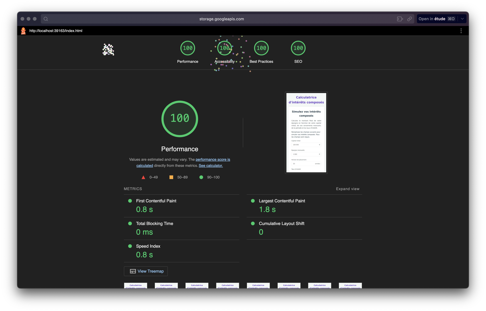

# Rapport technique - Calculatrice d'intérêts composés

## Contexte

### Objectifs

Developper une calculatrice d'intérêts composés accessible et proposer une documentation pour la compréhension et la reproduction du calcul.

1. Nos contraintes de développements:
  - Respect des normes d'accessibilité
  - Respect d'une rétro-compatibilité minimale avec des versions arbitraires des navigateurs
  - Performances optimales pour connexion lentes

2. Nos workflows

  - CI/CD automatisé
  - Revue de code systématique via PR
  - Branche `preprod` pour tests finaux

### Équipe

- Djedje GBOBLE
- Faustine CHARRIER
- Louisan TCHITOULA
- Mattis ALMEIDA LIMA
- Julien HEITZ

## Technologies

### Stack technique

1. Core

- HTML5
- CSS3
- JavaScript, norme ES5

2. Librairies

- Chart.js, version 2.9.4 (dernière version compatible IE)
- Github Actions
  - Lighthouse
  - Minification:
    - html-minifier
    - postcss
    - terser

### Formule Mathématique

```math-tex
  Montant final = [Capital initial × (1 + Taux périodique)^(Nombre total de périodes)] + [Versement périodique × (((1 + Taux périodique)^(Nombre total de périodes) - 1) / Taux périodique)]
```

## Accessibilité

### Compatibilité navigateurs

Navigateurs testés:
  - IE 10 - 2012
  - Tor 7.5 - 2018
  - Chrome 30 - 2013
  - Firefox 40 - 2015

Correctifs spécifiques:
  - Remplacement des Flexbox par des Float
  - Utilisation des préfixes propriétaires pour avoir des fallbacks sur certaines propriétés CSS:
    - `-ms-`
    - `-webkit-`
    - `-moz-`
    - `-o-`

```css
.input-suffix {
    position: absolute;
    right: 12px;
    top: 50%;
    -webkit-transform: translateY(-50%);
    -moz-transform: translateY(-50%);
    -ms-transform: translateY(-50%);
    -o-transform: translateY(-50%);
    transform: translateY(-50%);
    font-size: 14px;
    color: #545962;
}
```

### Compatibilité machines

Grâce aux `@media` queries et aux propriétés de layout, nous avons pu avoir une approche Mobile-First et responsive. L'application est compatible avec des devices taille Desktop, Tablette et Mobile.

### Comportement VoiceOver

Outils de VoiceOver testés:
  - NVDA
  - VoiceOver natif macOS
  - JAWS

Implémentation spécifiques:
- Mise en place de label ARIA
- Sémantique adapté
- Navigation clavier complète

La plateforme est entièrement couverte par le VoiceOver, à l'exception du graphique qui est un canva. Pour contourner l'absence d'accessibilité du canva, nous avons un tableau récapitulatif des données sur lequel le VoiceOver peut naviguer.



### Rapport de performances d'accessibilité

## Performances

### Métriques clés

| Fichier       | Taille originale | Taille minifiée | Réduction |
|---------------|------------------|-----------------|-----------|
| index.html    | 17 Ko            | 3.4 Ko           | 80%       |
| main.css      | 7 Ko             | 1.2 Ko            | 82%     |
| main.js       | 6 Ko             | 1.5 Ko            | 75%       |
| chart.min.js  | 46 Ko           | (incluse)       | -         |

### Vitesses de chargement

- Temps TTFB (time to first byte): 450 ms (GitHub Pages) 
- First Contentful Paint : 0.8s
- Speed index: 0.8s



## Processus de déploiement

### Collaboration

1. Proposer une feature, un fix ou une amélioration en créant une Issue
  Si l'issue est validée, créer une branche sur laquelle réaliser le développement
2. Créer une PR de votre branche sur `preprod` qui devra être validé par au moins une personne
  Si la PR est validée, merge sur `preprod`
3. Lors d'une montée de version, merge `preprod` sur `main`, le déploiement se déclenche automatiquement

### Automatisation

Le processus de déploiement est complètement automatisé et se déroule en 3 étapes :

  1. Minification des différents fichiers
  2. Test des performances avec Lighthouse. Si les performances n'atteignent pas nos standards, le déploiement échoue à cette étape
  3. Déploiement sur github pages

